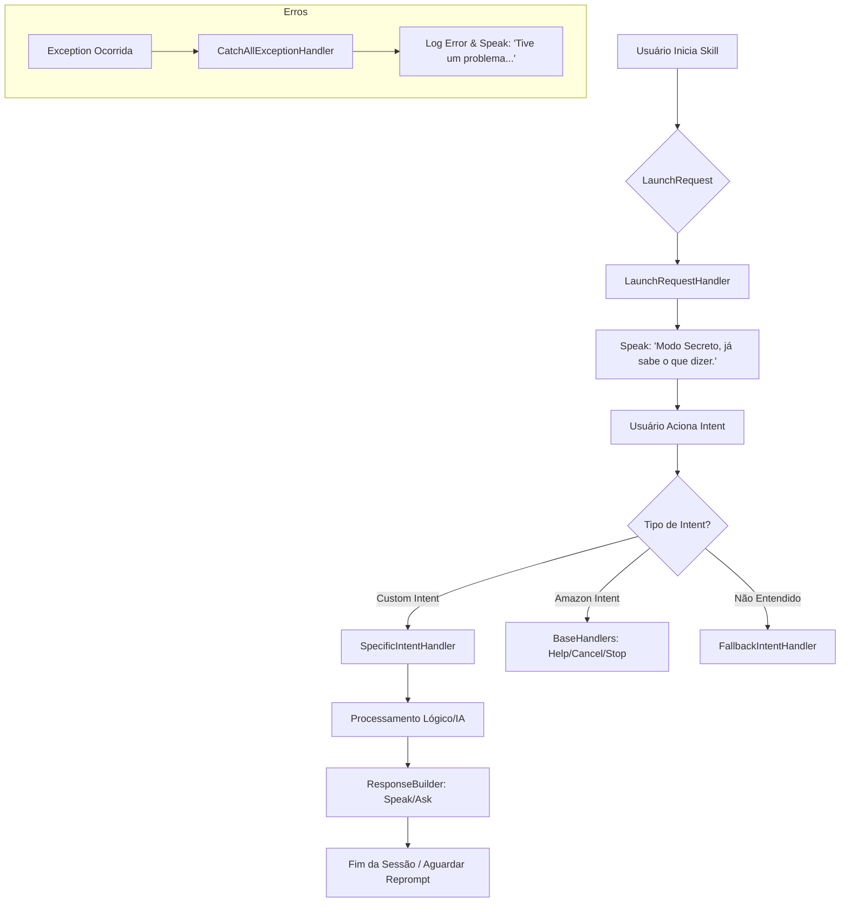

# DOCUMENTAÇÃO AVANÇADA - Projeto Alexa

Esta documentação serve como manual técnico e guia de evolução para o ecossistema de skills Alexa (Bora e Finances), focando em padrões de arquitetura ASK SDK e design de voz.

## 1. Mapa de Possibilidades (Intents)

### Intents Atuais (Skill Bora)
- **BoraIntent**: Focado em descoberta de habilidades e motivação.
- **PlayAutoplagioIntent / PlayAutoplagioFinalIntent**: Controle de reprodução de música autoral.
- **ChatFinancesIntent**: Registro de transações financeiras via linguagem natural.
- **ReportIssueIntent**: Reporte de problemas/bugs integrado ao GitHub.
- **ClosedIssuesCountIntent**: Ranking de desenvolvedores baseado em issues fechadas.

### Sugestões de Evolução (Retenção)
1. **DailyChallengeIntent**: Desafio diário de produtividade ou financeiro para incentivar o uso recorrente.
2. **NotificationOptInIntent**: Solicitação de permissão para enviar notificações proativas (ex: lembrete de transação ou nova música).
3. **UserProfileIntent**: Personalização da experiência (nome do usuário, preferências de voz) persistida no DynamoDB.
4. **StreakTrackerIntent**: Gamificação que premia o usuário por interações consecutivas (ex: "7 dias seguidos registrando gastos").
5. **SkillConnectIntent**: Integração entre as skills Bora e Finances para permitir fluxos cruzados (ex: pedir motivação após registrar uma dívida).

## 2. Design de Voz e SSML

Para tornar as respostas menos robóticas, utilizamos variações de vozes e efeitos SSML (Speech Synthesis Markup Language).

### Variações de Vozes (Polly)
Utilize a tag `<voice>` para alternar entre diferentes personas. No projeto, a voz **Ricardo** é a padrão para o tom profissional.
```xml
<speak>
    <voice name="Ricardo">Olá, sou o seu assistente de produtividade.</voice>
    <voice name="Vitoria">E eu sou a sua assistente financeira.</voice>
</speak>
```

### Efeitos Emocionais e Sussurro
- **Sussurro**: Ideal para informações confidenciais ou "segredos" do sistema.
```xml
<speak>
    <amazon:effect name="whispered">Estou processando seus dados em modo ultra secreto.</amazon:effect>
</speak>
```
- **Tons Emocionais**: Ajuste a velocidade (`prosody rate`) e tom (`prosody pitch`) para simular emoções.
```xml
<speak>
    <prosody rate="fast" pitch="high">Parabéns! Você alcançou o topo do ranking hoje!</prosody>
</speak>
```

### Efeitos Sonoros (Audio Player & Sound Library)
Integre sons curtos da biblioteca da Amazon para confirmar ações:
```xml
<speak>
    <audio src="soundbank://soundlibrary/ui/gameshow/amzn_ui_sfx_gameshow_positive_response_01"/>
    Transação registrada com sucesso.
</speak>
```

## 3. Gestão de Contexto e Atributos

A Alexa é "sem estado" por padrão. Para manter a memória entre turnos e sessões, utilizamos o `AttributesManager`.

### Atributos de Sessão (Curto Prazo)
Duram apenas enquanto a skill está aberta.
```python
# No handle()
session_attr = handler_input.attributes_manager.session_attributes
session_attr["last_intent"] = "BoraIntent"
handler_input.attributes_manager.session_attributes = session_attr
```

### Atributos Persistentes (Longo Prazo)
Utilizados para "lembrar" do usuário em dias diferentes (ex: DynamoDB).
```python
# Requer persistencia configurada no SkillBuilder
attr_manager = handler_input.attributes_manager
persistent_attr = attr_manager.persistent_attributes

if "user_name" not in persistent_attr:
    persistent_attr["user_name"] = "Rodolfo"

attr_manager.save_persistent_attributes()
```

## 4. Fluxograma Lógico (Mermaid)



## 5. Melhores Práticas e Arquitetura

### Padrões ASK SDK
- **Handlers Desacoplados**: O projeto já segue a boa prática de separar `base` handlers de `custom` handlers em arquivos distintos.
- **Interceptores**: Implementar `RequestInterceptor` para logging global de requests e `ResponseInterceptor` para persistência automática.
- **Centralização de Strings**: Mover respostas SSML para um arquivo `responses.py` para facilitar a internacionalização e manutenção.

### Recomendações de Melhoria
1. **Validação de Slots**: Usar `dialog_management` para garantir que slots obrigatórios (como `transacao`) sejam preenchidos antes de chegar ao código lógico.
2. **Error Handling Granular**: Criar ExceptionHandlers específicos para erros de rede (IA/GitHub) em vez de apenas um `CatchAll`.
3. **Async/Await**: Para chamadas de API (GitHub/IA), considerar o uso de bibliotecas assíncronas para não travar o loop de execução da Lambda.
4. **Logging Estruturado**: Utilizar JSON logging para facilitar a análise de métricas no CloudWatch.

---
*Documento gerado automaticamente pelo assistente de IA em 2026-05-01.*
