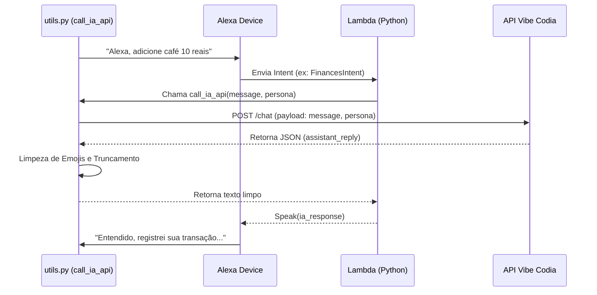
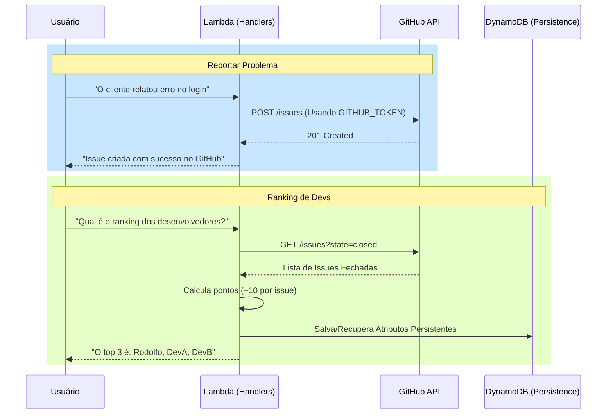
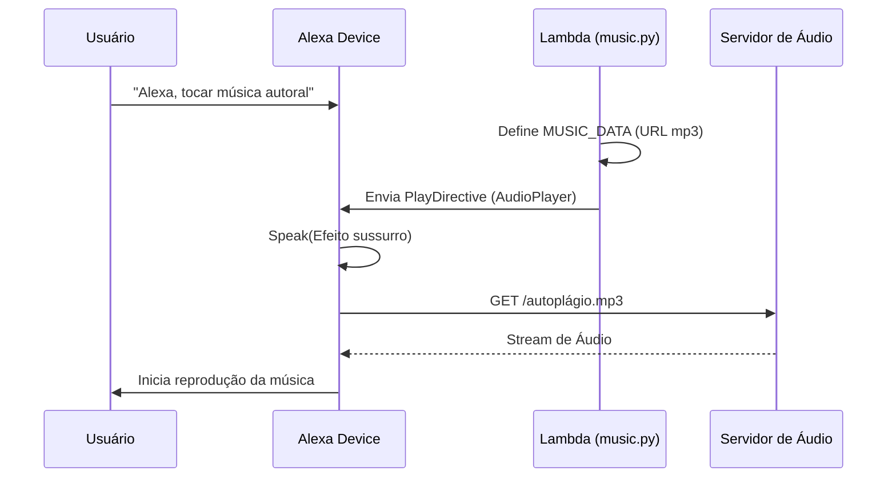
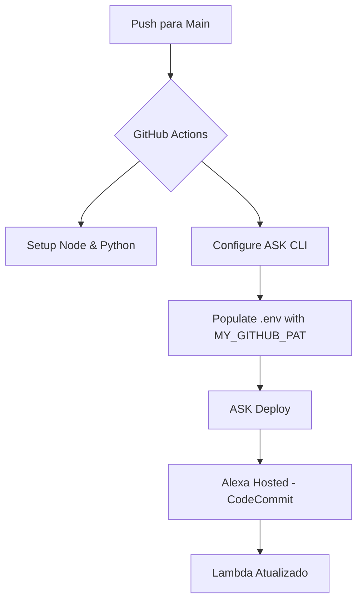

# Fluxos das Skills Alexa

Documentação técnica dos fluxos de dados e integrações das skills **Bora** e **Finances**.

## 1. Fluxo de Inteligência Artificial (Vibe Codia)
Utilizado para processar linguagem natural e gerar respostas dinâmicas ou analisar problemas.

---

## 2. Fluxo de Integração GitHub (Issues & Ranking)
Utilizado para reportar problemas e calcular o ranking de desenvolvedores.

---

## 3. Fluxo de Áudio (Music Player)
Utilizado para tocar músicas autorais armazenadas remotamente.

---

## 4. Fluxo de Deploy (CI/CD)
Automação de entrega via GitHub Actions.

